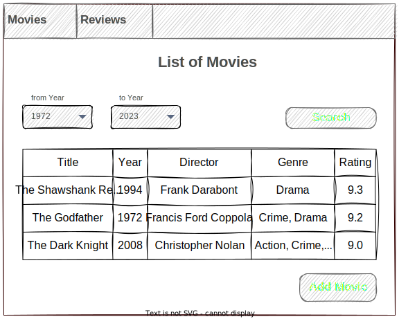
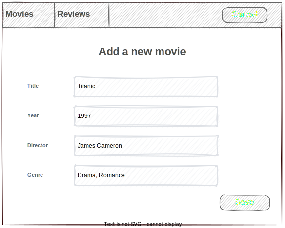
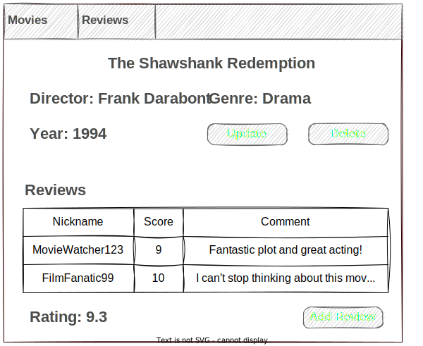
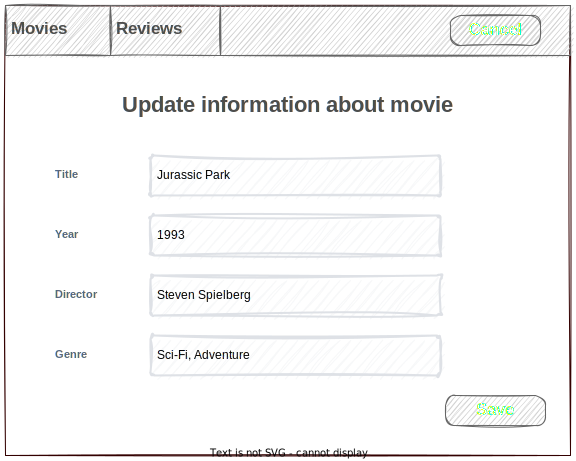
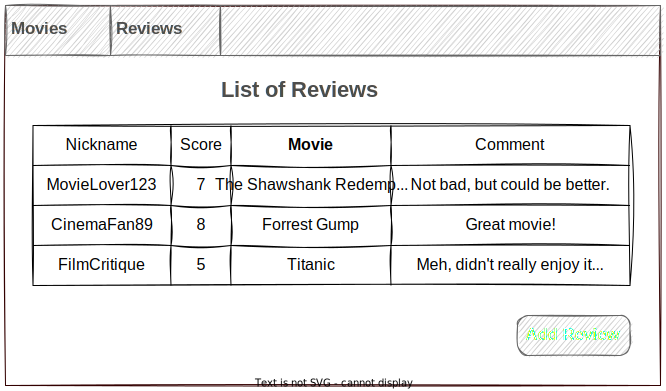
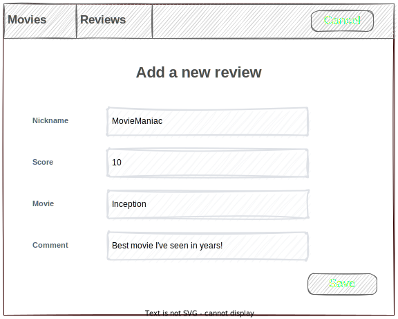
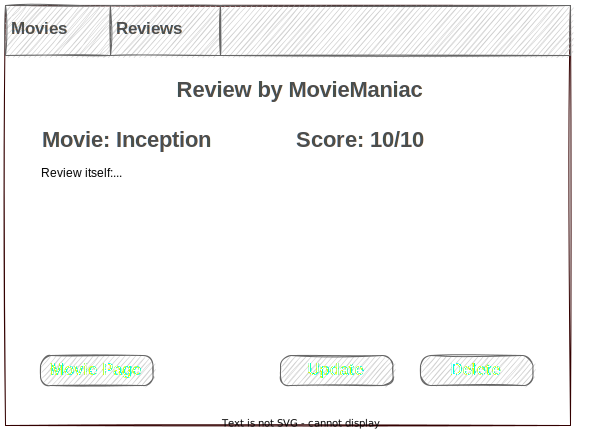
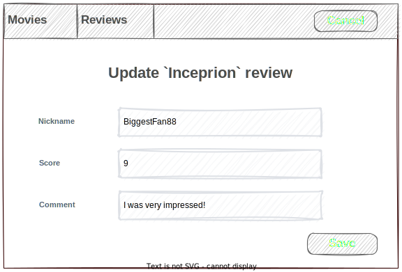

# Cinemate

## Vision
"Cinemate" is a web-application that allows users to record information about movies and their reviews.

Application should provide:
* Storing movies and reviews in a database;
* Displaying list of movies;
* Updating the list of movies (adding, editing, removing);
* Displaying list of reviews;
* Updating the list of reviews (adding, editing, removing);
* Displaying list of reviews for each movie;
* Filtering for movies by year.

## 1. Movies
### 1.1 Display a list of movies

This page is designed to view the list of movies and filter them by creation time.

**Main scenario:**
* The user selects the item `Movies`;
* The application displays a list of movies.

Pic 1.1 A view of the movie list.

The list displays the following columns:
* Title - title of the movie;
* Year - the year the film was released;
* Director - full name of the person who directed the movie;
* Genre - the genre(s) of the movie;
* Rating - number from 1 to 10 that represents the movie score.

**Filtering by date:**
* The user sets a date filter and presses the `Search` button;
* The application displays only the movies that were published between the chosen dates.

### 1.2 Add a movie

This page is designed to add new movies to the database.

**Main scenario:**
* In the movies list view mode, the user clicks the `Add Movie` button;
* The application displays a form for entering movie information;
* The user enters movie data and presses `Save` button;
* If any data is entered incorrectly, incorrect data messages are displayed;
* If the entered data is correct, a record is added to the database;
* An error message is displayed if an error occurs;
* If a new movie record is successfully added, then a list of movies with the added record is displayed.

**Cancel operation scenario:**
* In the movies list view mode, the user clicks the "Add Movie" button;
* The application displays a form for entering movie information;
* The user enters or does not enter movie data and presses `Cancel` button;
* Data is not saved to the database, the user sees a list of movies with no changes;
* If the user selects any other part of the app (like `Movies` or `Reviews` menu options), or simply leaves the page, the data won't be saved to the database and the corresponding form will be opened.

Pic 1.2 Add movie.

When adding a movie, the following details are entered:
* Title - title of the movie;
* Year - the year the film was released;
* Director - full name of the person who directed the movie;
* Genre - the genre(s) of the movie;

### 1.3 Movie page

This page is designed to view information about the movie and its reviews. It also contains buttons to add/update/delete data.

**Main scenario:**
* In the movies list view mode, the user clicks on the movie title;
* The application displays the page with all the information about the movie, its reviews, a link to add a new review, and buttons to update or delete pages for the movie itself.

**Update scenario:**
* The user presses the `Update` button;
* The application directs the user to a page that contains update functionality.

**Delete scenario:**
* The user presses the `Delete` button;
* A record in the database is removed;
* A flash message is displayed if an error occurs;
* If the movie record is successfully deleted, then the user is redirected to the movies page.

**Add review scenario:**
* The user presses the `Add Review` button;
* The application redirects the user to the Add Review page.

Pic 1.3 Movie page.

### 1.4 Update movie

This page is designed to update current information about existing movie.

**Main scenario:**
* The user clicks `Update` button on the movie page;
* The application displays a form to update movie information with prepopulated data;
* The user updates movie data and presses `Save` button;
* If any data is entered incorrectly, incorrect data messages are displayed;
* If the entered data is correct, the record is updated in the database;
* If an error occurs, an error message is displayed;
* If the record is successfully updated, then the movie page with updated data is displayed.

**Cancel operation scenario:**
* The user clicks `Update` button on the movie page;
* The application displays a form to update movie information with prepopulated data;
* The user enters or does not enter new data and presses `Cancel` button;
* Changes are not saved into the database, movie data without changes is displayed to the user;
* If the user selects any other part of the app (like `Movies` or `Reviews` menu options), or simply leaves the page, the data won't be saved to the database and the corresponding form will be opened.

Pic 1.4 Update movie form.

When updating information about the movie, the following details are entered:
* Title - title of the movie;
* Year: the year the movie was released;
* Director - full name of the person who directed the movie;
* Genre - the genre(s) of the movie;

## 2. Reviews
### 2.1 Display list of reviews

This page is designed to show the list of reviews.

**Main scenario:**
* The user selects the item `Reviews`;
* The application displays a list of reviews.

Pic 2.1 View of reviews list.

The list displays the following columns:
* Nickname - nickname of the user;
* Score - a number from 1 to 10 given to a movie by the user as a score;
* Movie - the title of the film;
* Comment - a few words about the movie itself.

### 2.2 Add Review
**Main scenario:**
* The user clicks `Add Review` button in the review list view mode;
* The application displays a form for entering review information;
* The user enters review data and presses `Save` button;
* If any data is entered incorrectly, incorrect data messages are displayed;
* A record is added to the database if the entered data is correct;
* If an error occurs, an error message is displayed;
* If a new review record is successfully added, then a list of reviews with the added record is displayed.

**Cancel operation scenario:**
* The user clicks `Add Review` button in the review list view mode;
* The application displays a form for entering review information;
* The user enters or does not enter review data and presses `Cancel` button;
* Data is not saved to the database, the user sees a list of reviews with no changes;
* If the user navigates to another section of the app (such as the `Movies` or `Reviews` menu options) or simply exits the page, the data will not be saved to the database and the corresponding form will be displayed.

Pic 2.2 Add review.

When adding a review the following details are entered:
* Nickname - nickname of the user;
* Score - a number from 1 to 10 given to a movie by the user as a score;
* Movie - the title of the movie;
* Comment - a few words about the movie itself.

### 2.3 Review page

This page is intended for viewing, updating, and deleting reviews.

**Main scenario:**
* The user selects a review;
* The application displays a page with all the review's information and a button to update or delete it. There is also an option to go back to the movie page.

**Update scenario:**
* The user presses the `Update` button;
* The application directs the user to a page that contains update functionality.

**Delete scenario:**
* The user presses the `Delete` button;
* Record is deleted from the database;
* If error occurs, then flash message is displayed;
* If the review record is successfully deleted, then the user is redirected to the reviews page.

**Movie page scenario:**
* The user selects the `Movie Page` option;
* The application redirects user to the page of the corresponding movie.

Pic 2.3 Review page.

### 2.4 Update review

This page is designed to update current information about an existing review.

**Main scenario:**
* The user clicks `Update` button on the review page;
* The application displays a form to update review information with prepopulated data;
* The user updates the review and presses `Save` button;
* If any data is entered incorrectly, incorrect data messages are displayed;
* If entered data is valid, then record is updated in the database;
* If error occurs, then error message is displayed;
* If the record is successfully updated, then the updated review is displayed.

**Cancel operation scenario:**
* The user clicks `Update` button on the review page;
* The application displays a form to update the review with prepopulated data;
* The user updates or does not update the review and presses `Cancel` button;
* Changes are not saved into the database, review without changes is displayed to the user;
* If the user selects any other part of the app (like `Movies` or `Reviews` menu options), or simply leaves the page the data won't be saved to the database and the corresponding form will be opened.

Pic 2.4 Update review form.

When updating a review, the following details are entered:
* Nickname - nickname of the user;
* Score - a number from 1 to 10 given to a movie by the user as a score;
* Comment - a few words about the movie itself.